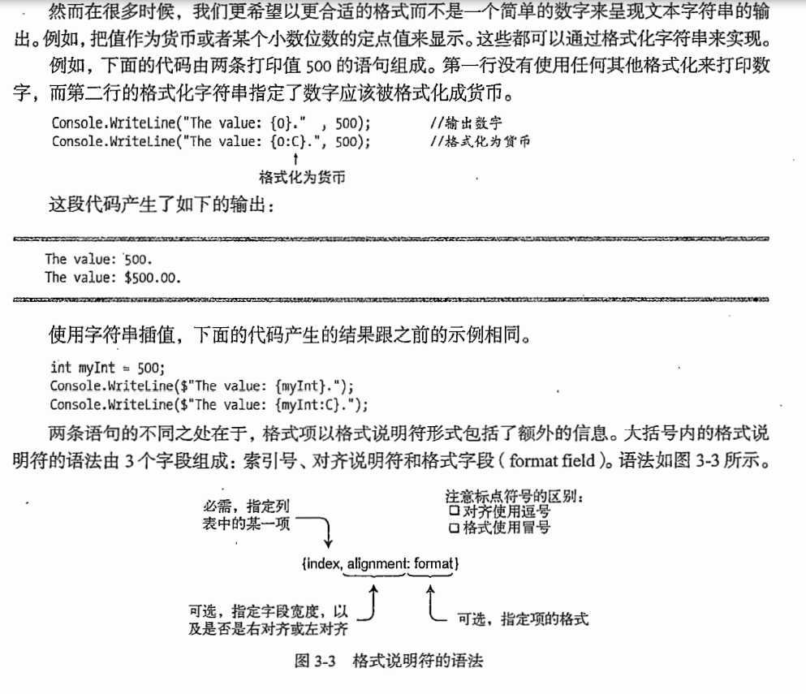

# 第一个C#程序

## 控制台的输出：

C#提供Write与Writeline，顾名思义，后者可以提供自动换行。

二者均支持格式化的字符输出：

```csharp
namespace HelloWorld
{
    public class Program
    {  
        static void Main(string[] args)
        {
            Console.WriteLine("HelloWorld{0}{1}",3,2);
        }
    }
}
```

除了这种格式化输出方式C#6.0还提供了另外一种的格式化方式：

```csharp
namespace HelloWorld
{
    public class Program
    {  
        static void Main(string[] args)
        {
            int var1 = 3;
            int var2 = 4;
            Console.WriteLine($"HelloWorld {var1} {var2}");
        }
    }
}
```

第一种格式化方式支持多重标记与重复使用：

```csharp
Console.WriteLine("HelloWorld{0}{1}{1}{0}",3,2);
```

值可以以任何顺序使用，值可以在字符串中替换任意次，但是前面使用的{}不可超过替换列表的总长。如上程序中，替换列表中只有3和2，对应的是{0}和{1}，但是不可出现{2}，因为替换列表中不存在{2}。

这个index可以是一个变量名，也可以是替换列表中的索引。



1. 对齐说明符号

默认右对齐如{0,10}即是右对齐10个字符长度，而左对齐则是{0,-10}。

如果要表示的字符数比对齐说明符中指定的长度要短，那么其余字符就会以空格补充。

反之对齐符会被忽视，直接显示所要表示的字符。

1. 格式字段

格式字段如下展示：

```
:Axx
```

冒号后面必须跟紧格式说明符号

格式说明符是单个字母符号，代表着不同的格式。

后面两个xx代表着精度，由1-2个数字组成。

如：

```csharp
Console.WriteLine("HelloWorld{0:F1}",3);
```

F代表保留小数点后，1代表一位。即保留小数点后一位。

下面给出了9种数字说明符：


注释和C差不多不再赘述。