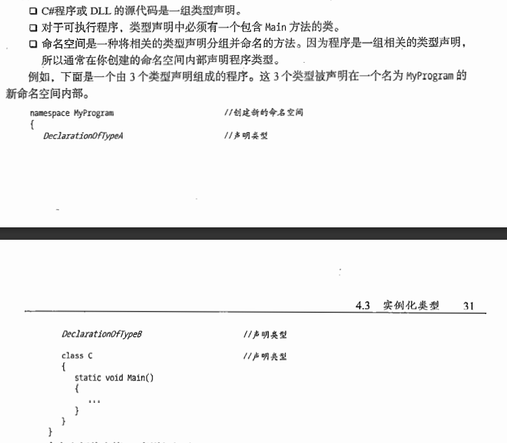

# 类型存储与变量

## C#程序是一组类型说明

对于C#程序而言，其内部结构是如下的模板：

## 类型是一种模板

类型由以下元素来定义：

1. 名称
2. 用于保存数据成员的数据结构
3. 该类型的行为与约束条件

如int类型：

名称为int，结构为4字节

行为为32位整数。

### 依据某个类型创建的实际对象称为实例化类型。

C#种每个数据项都是某种类型的实例。

## 数据成员与函数成员

## 预定义类型

C#提供了16种预定义的类型

如下：

所有预定义的类型都直接映射到.NET类型。C#类型名称就是.NET类型的别名，但是不推荐在C#程序中使用.NET的类型名称。

## 用户定义类型

## 值类型与引用类型

二者相当于C++中的变量与指针的关系

## C#的变量与C++类似

## 静态类型与dynamic关键字的产生

