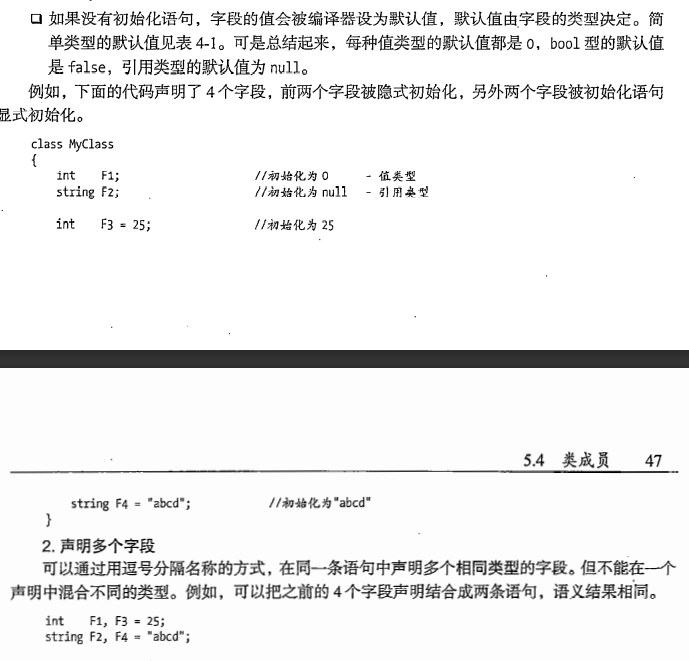

# 类的概述

## 类是一种活动的数据结构

程序的数据和功能被组织为逻辑上相关的数据项和函数的封装集合，并被称为类。

与C++相同，C#的类也包含了数据成员与函数成员。

声明类与C++相同。

## 类成员

数据成员对应字段，函数成员对应方法。

### 字段

字段隶属于类的变量

字段的显式和隐式初始化

```csharp
int F1 = 9;
```

如上是显式的初始化。若在定义一个字段时没有对其进行初始化，则会触发隐式初始化。



## 方法与C++中的类方法一致

## 创建类与类的实例

类是引用类型，所以它们在为数据引用和实际数据都需要申请内存。

C#中使用new关键字来为其分配内存

```csharp
class Example{};
Example theDealer = new Example();
```

## 类中的访问修饰符与C++一致

在类外访问数据仍然是使用  . + 名称  的方式。